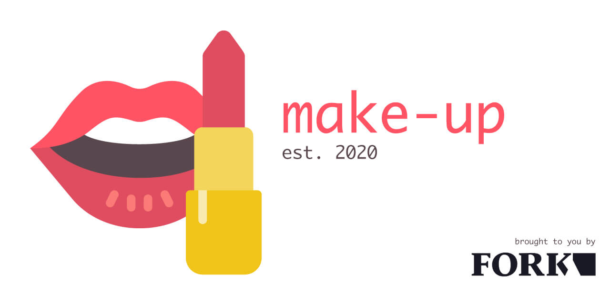

# Make-up



**Being a web developer is hard.** You often find yourself asking stuff like:

- _How to setup this project?_
- _Which script will start the compilation?_
- _How to deploy?_ or
- _How to sync between environments?_

These things can really **slow down the process** of development if they are not sufficiently documented.

By covering all necessary requirements for the development process **automatically**, _Make-up_ gives you more time for creativity.

No matter what project you are working on, no matter what software is used: _Make-up_ will **make it work** (@see [Supported software](#supported-software)).

_Make-up_ does stuff like:

<details>
  <summary>
    Initial project setup after git clone
  </summary>
  
  _Make-up_ installs all required tools to get you started with development.
</details>

<details>
  <summary>
    Start developing process
  </summary>
  
  _Make-up_ controls all necessary background-processes so that you can focus on programming.
</details>

<details>
  <summary>
    Deployment
  </summary>
  
  _Make-up_ shows you where and how you can successfully deploy your project.
</details>

<details>
  <summary>
    Sync between environments
  </summary>
  
  _Make-up_ synchronizes databases and files between different environments.
</details>

More features [here](#features).

---

**Table of contents**

<!-- TOC -->

- [Make-up](#make-up)
  - [Requirements](#requirements)
  - [Add Make-up to your project](#add-make-up-to-your-project)
  - [Features](#features)
    - [Make-up works with](#make-up-works-with)
  - [Customization](#customization)
    - [Add a new command](#add-a-new-command)
      - [Run a script from a command](#run-a-script-from-a-command)
      - [Access environmental variables](#access-environmental-variables)
    - [Overwrite an existing command](#overwrite-an-existing-command)
    - [Extend an existing command](#extend-an-existing-command)
    - [Create a new bash script](#create-a-new-bash-script)
  - [Troubleshooting](#troubleshooting)
    - [Craft CMS 3](#craft-cms-3)
      - [Invalid working directory specified](#invalid-working-directory-specified)
  - [To Dos](#to-dos)

<!-- /TOC -->

---

## Requirements

- Terminal application which can run _Linux_ commands

## Add _Make-up_ to your project

1. Add _Make-up_ as a _submodule_ to your project:

   ```bash
   cd my-project
   git submodule add https://github.com/fork/make-up
   ```

   or get the latest files if Make-up is already listed in your [../.gitmodules](../.gitmodules):

   ```bash
   cd my-project
   git submodule update
   ```

1. Install _Make-up_

   ```bash
   cd make-up
   make install-make-up
   ```

   This will create a reference _Makefile_ and a _.env_ file. This enables you to use _Make-up_'s [Makefile](Makefile) from inside your project root directory.

   The _.env_ file is where we will put **sensible information like passwords** etc. to synchronize and deploy from and to different environments (and other stuff). To avoid having this information in your project, make sure _.env_ files are never added to your repository.

   <details>
      <summary>
        My project already contains a <em>.env</em> file, can I continue using that one?
      </summary>

   **Yes you can.** Just create a reference:

   ```bash
   cd my-project

   # remove .env file (generated by '$ make install-make-up')
   rm .env

   # create symbolic link to your real .env file
   ln -s path-to/.env .env
   ```

   </details>

1. Add this to your Readme

   ```md
   **This project uses [Make-up](http://github.com/fork/make-up).**
   ```

1. Add this to the description of your project setup

   ```md
   After `$ git clone` run this command to enable _Make-up_ in your project:

   `$ git submodule update`

   Setup _Make-up_ as described [here](make-up/README.md#add-make-up-to-your-project).
   ```

1. Now you may use _Make-up_ from your project root:

   ```bash
   cd my-project
   make help
   ```

## Features

To list all available _Make-up_ commands run

```bash
cd my-project

# Help
make help
```

### _Make-up_ works with

_Make-up_ currently works with:

- Craft CMS 3 (Docker)
- Docker
- NPM
- Yarn
- MySQL

## Customization

The scripts provided here contain general information to work for as many different project-setups as possible. All functions can therefore be modified, extended or overwritten.

### Add a new command

You may add your custom _Makefile_ methods to [./../Makefile](./../Makefile):

```Makefile
## this comment will appear in `$ make help` as a description of 'foo'
foo:
  @echo Bar
```

They will automatically show up in when you run `$ make help`.

#### Run a script from a command

You may run a bash script from a Makefile command like so:

```Makefile
@./path-to/foo.bash
```

If you want to run an existing script from _Make-up_, use the following:

```Makefile
@./$(HELPER_SCRIPTS)/foo.bash
```

#### Access environmental variables

From within your Makefile, you have direct access to each variable stored in _../.env_.

So if this was in your _.env_ file:

    FOO="bar"

you could call the variable _FOO_

- in your custom _bash_ script

  ```bash
  echo $FOO
  ```

- or in your [../Makefile](../Makefile)

  ```Makefile
  echo "$(FOO)"
  ```

### Overwrite an existing command

You may overwrite an existing command in [../Makefile](../Makefile), by reusing a method name, already appearing in `$ make help`. You may continue as if you would [add a new command](#add-a-new-command).

**Note:** _An overwridden command will produce a warning (which is ok) like this:_

    Makefile:x: warning: overwriding commands for target `foo'
    make-up/Makefile:123: warning: ignoring old commands for target `foo'
    Bar

### Extend an existing command

You may extend existing methods with custom bash scripts. To do so, you need to put them in a specific folder and structure:

```bash
cd my-project

# create directory
mkdir more-make-up
```

You may now mirror the structure of _Make-up_ like so:

```
make-up
  → scripts
    → foo
      → bar.bash

more-make-up
  → scripts
    → foo
      → bar.bash
```

Whenever a script in _Make-up_ is run – for example _make-up/scripts/foo/bar.bash_, _Make-up_ tries to execute _more-make-up/scripts/foo/bar.bash_ if it exists.

### Create a new bash script

Begin every bash script with the following lines:

```bash
#!/bin/bash

# load helper
my_dir="$(dirname "$0")"
source "$my_dir/../../helper.bash"
```

After having the [./helper.bash](./helper.bash) loaded, you may access gloabl variables like colors, text-transforms, etc. to decorate your output.

**Note:** _Before you can execute a bash script, set the correct permissions:_

```bash
chmod +x foo.bash
```

## Troubleshooting

### Craft CMS 3

<details>
  <summary>
    Expand
  </summary>

---

#### Invalid working directory specified

During installation this error message may come up:

```
[RuntimeException]
Invalid working directory specified, /var/www/html does not exist.
```

**Solution:** Remove all docker containers and restart the project

---

  </details>

## To Dos

- **20.01.2020** `make production-to-dev` funktioniert nicht wenn mysql nicht auf einem server installiert ist. das ist zwar richtig, im fork-kontext muss dafür aber eine lösung her.
- **20.01.2020** `make staging-to-dev` funktioniert nicht wenn mysql nicht auf einem server installiert ist. das ist zwar richtig, im fork-kontext muss dafür aber eine lösung her.
- **23.01.2020** Craft und docker sollten vielleicht in das Verzeichnis craft wandern, da docker für craft configuriert wurde.

---

Brought to you by [4rk](https://fork.de) – 01/2020
